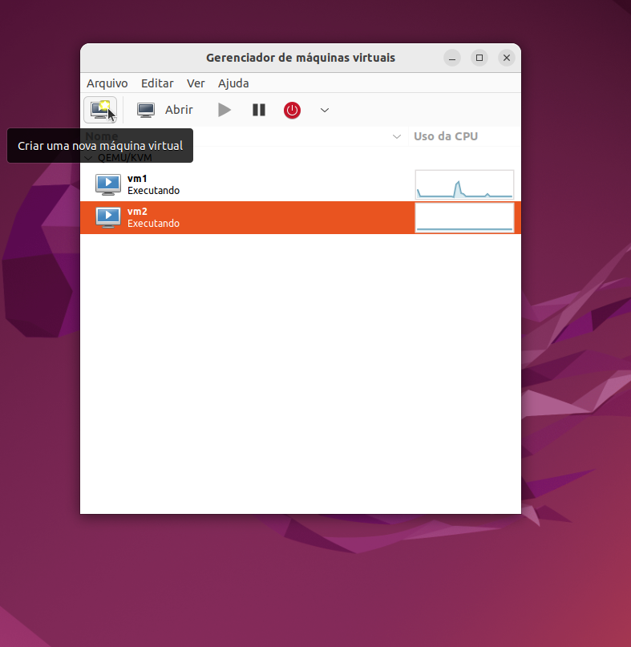

# Sistema de Criptografia Distribuído com gRPC

## Visão Geral do Projeto

Este projeto implementa um sistema distribuído de criptografia usando:
- **Web Client**: Interface React para usuários
- **API Gateway**: Stub gRPC que recebe requisições HTTP e roteia para os servidores gRPC
- **Servidor de Codificação**: Serviço gRPC para criptografar texto usando cifra de Vigenère
- **Servidor de Decodificação**: Serviço gRPC para descriptografar texto usando cifra de Vigenère

## Pré-requisitos

- Node.js
- Python

## Estrutura do Projeto

```
├── web/                 # Aplicação React
├── gateway/             # Stub gRPC (Node.js)
├── encryptionServer/    # Servidor gRPC A para codificação (Python)
├── ecryptionServer/     # Servidor gRPC B para decodificação (Python)
└── shared/              # Arquivos compartilhados (proto e requirements)
```

## 1. Web Client (React)

### Configuração e Execução

```bash
cd web

# Instalar dependências
npm install

# Configurar variáveis de ambiente
cp .env.example .env # Editar .env para apontar para o API Gateway

# Executar aplicação
npm run dev
```

## 2. API Gateway (Node.js)

### Configuração e Execução

```bash
cd gateway

# Instalar dependências
npm install

# Gerar código gRPC a partir do protofile (Os arquivos _pb2.js e _pb2_grpc.js)
npm run generate

# Configurar variáveis de ambiente
cp .env.example .env # Editar com os endereços dos servidores gRPC

# Executar
npm start
```

## 3. Servidor de Codificação (Python)

### Configuração e Execução

```bash
cd encryptionServer

# Criar ambiente virtual (recomendado)
python3 -m venv venv
source venv/bin/activate  # Linux/Mac
# ou venv\Scripts\activate  # Windows

# Instalar dependências
pip install -r ../shared/requirements.txt

# Gerar código gRPC a partir do protofile (Os arquivos _pb2.js e _pb2_grpc.js)
python3 -m grpc_tools.protoc -I../shared --python_out=. --grpc_python_out=. ../shared/crypto.proto

# Executar servidor
python3 encryption_server.py
```

## 4. Servidor de Decodificação (Python)

### Configuração e Execução

```bash
cd decryptionServer

# Criar ambiente virtual (recomendado)
python3 -m venv venv
source venv/bin/activate  # Linux/Mac
# ou venv\Scripts\activate  # Windows

# Instalar dependências
pip install -r ../shared/requirements.txt

# Gerar código gRPC a partir do protofile (Os arquivos _pb2.js e _pb2_grpc.js)
python3 -m grpc_tools.protoc -I../shared --python_out=. --grpc_python_out=. ../shared/crypto.proto

# Executar servidor
python3 decryption_server.py
```


## Criação e Configuração das VMs com QEMU/KVM

### Instalação do Ambiente de Virtualização

```bash
sudo apt update
sudo apt install qemu-kvm libvirt-daemon-system libvirt-clients virtinst bridge-utils virt-manager expect

sudo adduser $USER kvm
sudo adduser $USER libvirt
```

Após isso, reinicie o sistema para aplicar os grupos.

Este sistema pode ser virtualizado com QEMU/KVM para simular um ambiente distribuído completo. Abaixo está o passo a passo para criar e configurar as VMs manualmente, porém este processo pode ser feito apenas rodando o comando:

```bash
cd vms
bash build_vms_bridge.sh 
```

Na qual cria uma versão otimizada puramente texto utilizando alpine, caso deseje uma solução mais robusta com o Ubuntu server, basta seguir o procedimento a seguir.

### Preparando a ISO

Baixe a ISO do Ubuntu Server 24.04.2 LTS (versão estável recomendada).

Transfira a ISO para a pasta de boot do Libvirt:

```bash
sudo cp ~/Downloads/ubuntu-24.04.2-live-server-amd64.iso /var/lib/libvirt/boot
```

### Criando a Rede Virtual

Entre na pasta `vms` do projeto e execute:

```bash
cd vms
virsh net-create vlan-vegenere.xml
virsh net-start
```

### Criando a Primeira VM com virt-manager

#### Passo 1: Abrir o Virt-Manager

Pode ser aberto via terminal com o comando:

```bash
virt-manager
```

#### Passo 2: Criar nova máquina virtual




#### Passo 3: Selecionar instalação via ISO


#### Passo 4: Selecionar a ISO


#### Passo 5: Definir memória e CPU


#### Passo 6: Definir armazenamento


#### Passo 7: Nomear VM e configurar rede

Nomeie como `vm1` e selecione a rede `vlan-vegenere`.


#### Passo 8: Iniciar instalação e escolher “Try or Install Ubuntu Server”


#### Passo 9: Escolher idioma e layout de teclado


#### Passo 10: Selecionar instalação minimizada


Após isso pode avançar algumas telas.

#### Passo 11: Definir nome do host e usuário


Após isso pode avançar uma tela.

#### Passo 12: Instalar OpenSSH Server


#### Passo 13: Finalizar a instalação
Depois só avançar e finalizar a instalação.


Após o término, desligue a VM para cloná-la.

### Clonando e Configurando VMs

#### Clonagem

Abra o `virt-manager`, clique com o botão direito em `vm1` e selecione "Clone".


Nomeie como `vm2` e repita o processo para criar `vm3`.


#### Configuração de MAC Address

Edite o MAC Address das VMs com:

```bash
virsh edit vmx  # x = número da VM
```

Na seção `<interface>`, defina:

- `vm1`: 52:54:00:00:00:11
- `vm2`: 52:54:00:00:00:12
- `vm3`: 52:54:00:00:00:13

### Renomeando o Host nas VMs

Acesse cada VM via SSH:

```bash
ssh usuario@192.168.100.101  # vm1
ssh usuario@192.168.100.102  # vm2
ssh usuario@192.168.100.103  # vm3
```

Altere o nome do host:

```bash
sudo hostnamectl set-hostname vm1  # ou vm2, vm3
```

Reinicie as maquinas:

```bash
virsh shutdown vm1
virsh shutdown vm2
virsh shutdown vm2
virsh start vm1
virsh start vm2
virsh start vm3
```

### Instalação dos Softwares por VM

#### Todos as VMs

```bash
sudo apt install git
```


#### VM1 (API Gateway e Web)

```bash
sudo apt install node
```

#### VM2 e VM3 (Servidores A e B)

```bash
sudo apt install python12.7-venv
```

### Testando o Sistema

Após isso é possível instalar os sistemas em cada máquina acessando-as via ssh e executando os comandos anteriormente listados.
